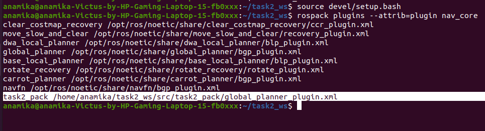

# Creating and Integrating the Plugin Successfully
I followed [http://wiki.ros.org/navigation/Tutorials/Writing%20A%20Global%20Path%20Planner%20As%20Plugin%20in%20ROS] for writing mt global planner plugin.

 For the global path planner we use c++ plugin in ros 
 
 For this plugin we use base global planner interface in nav_core package
 
 first `naviagtion package` queries the server-client plugin , this server client plugin  recieves info about costmap, velocity, goal and current state 
 
 Then this plugin send info to our path planning server which consists of algo of our logic.
 
 After that serve-client-plugin recieves planned path from path planning server which is further send to naviagtion package by plugin.
 
 This is how the global path planning plugin works .

 After following [http://wiki.ros.org/navigation/Tutorials/Writing%20A%20Global%20Path%20Planner%20As%20Plugin%20in%20ROS] my plugin was ready to use in which i just write algo for straight path.

 

 
 
